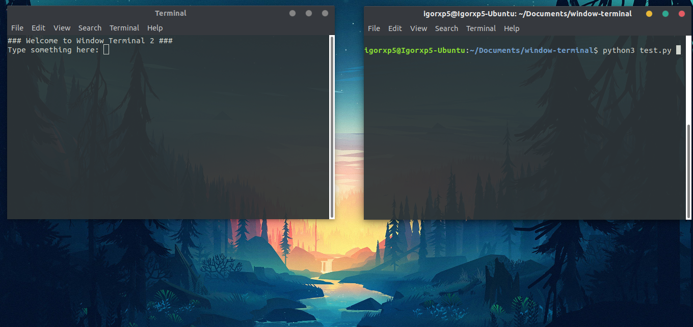

# window-terminal [](https://www.python.org/)

**window-terminal** is a Python module for start new Terminal Window with print and input control.

## Installation

Clone from this repository.

```bash
pip install window-terminal
```

## Usage

Below there are example, how to use this module.

```python
import time
from window_terminal import WindowTerminal

#### First Example: Print on Windows Terminal ####

# To instantiate a Window Terminal call 'WindowTerminal.create_window()' 
window1 = WindowTerminal.create_window()

# To Open a Window Terminal, call 'open()' from a object
window1.open()

# Print on Windown Terminal, call 'print()'
window1.print('Hello I\'m a Window Terminal!')

# The Window Terminal can be closed at any time
# For example: close after 3 seconds
time.sleep(3)
window1.close()

#### Second Example: Interact with Window Terminal ####

# Insantiating and opening it more...
window2 = WindowTerminal.create_window()
window2.open()

# And printing...
window2.print('### Welcome to Window Terminal 2 ###')

# To prompt for something to Window Terminal call 'input()'
# Current thread will be blocked until input is answered
something = window2.input('Type something here: ')

# Priting result...
print('Window Temrinal 2 replied:', repr(something))

# Closing Window Terminal 2
window2.close()

#### Third Example: Async Interact with Window Terminal ####

# # Insantiating and opening it for the last time...
window3 = WindowTerminal.create_window()
window3.open()

# We can define a function to be called when input is answered
def input_callback(result):
	print('Window Terminal 3 repled:', repr(result))

# Now, current thread not will be blocked, when 'input()' is called
window3.input('Other input, type something more here: ', input_callback)

# To prevent the script from closing,  call 'wait_close()' to block 
# current thread, until Window Terminal close (for example: user action).
window3.wait_close()

# Printing after Window Terminal 3 close
print('Window Terminal 3 was closed!')
```


## Screenshot



## Contributing
Pull requests are welcome. For major changes, please open an issue first to discuss what you would like to change.

Please make sure to update tests as appropriate.

## License
[MIT](https://raw.githubusercontent.com/Igorxp5/window-terminal/master/LICENSE)